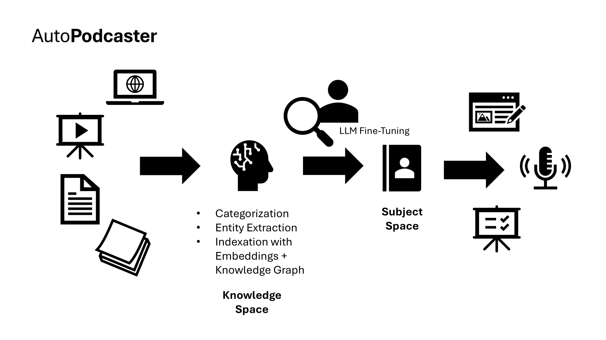
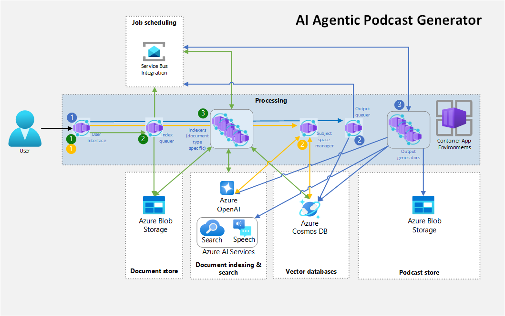

# AutoPodcaster

	

AutoPodcaster is an innovative application designed to streamline the process of staying informed. It aggregates a vast array of content, including website links, PDFs, videos, and audio files. The application then categorizes and organizes this content into a graph structure, making it easy to navigate and explore. This is called the `knowledge space`.

When the user wants to learn more about a specific topic, they can create a `subject space` within the application. The subject space is a curated collection of content related to the chosen topic. Output generators within the application can then create various outputs based on the subject space. For example, the application can generate a podcast, blog post, or presentation on the chosen topic.
 


AutoPodcaster leverages cutting-edge technologies such as Azure AI Search, Azure OpenAI, and multi-agent framework like Autogen to provide a seamless and efficient user experience. By automating the process of content aggregation, categorization, and output generation, AutoPodcaster enables users to stay informed and up-to-date on a wide range of topics without the need to use a notebook, categorize the content, and generate the output. It could be completely automated. We call this project a `ui-less` solution for information consumption.

AutoPodcaster was originally created by Pierre Malarme and Jorge Garcia Ximenez. It takes its current shape during Microsoft Global Hackathon 2024 by a team of passionate hackers who are committed to making information more accessible and easier to consume. It wins the local Belgium venue of the Global Hackathon and is now open-sourced for the community to use, contribute and improve. A big thank you to the team and to Mateo Echeverry Hoyos for the support cleaning this repository before publication.

[](https://github.com/pmalarme)
[](https://github.com/gxjorge)
[](https://github.com/cedricve)
[](https://github.com/bjcmit)
[](https://github.com/ivana61)
[](https://github.com/rdesutter)
[](https://github.com/KarolGel)
[](https://github.com/pikestel)
[](https://github.com/csrvn)
[](https://github.com/mateo762)

## Current state

Currently, there are some limitations to AutoPodcaster:
* The application is not fully functional and requires additional development to support all features.
* The graph structure is not implemented. The content is fetched using RAG and Azure AI Search.
* The extraction of entities and categories is not implemented yet.
* Only podcast generation is implemented.
* The generation of podcast using agentic framework is implemented currently only in Jupyter Notebook [outline_segment_.ipynb](notebooks/outline_segment_.ipynb).
* The subject space should be only a filter on the knowledge space when using RAG instead of creating each time a new index.

## Prerequisites

Before you begin, ensure you have the following tools and services installed:

- [Python 3.11+](https://www.python.org/downloads/)
- [Node.js](https://nodejs.org/en/download/)
- [Azure CLI](https://docs.microsoft.com/en-us/cli/azure/install-azure-cli)
- [FastAPI](https://fastapi.tiangolo.com/)
- [Docker](https://www.docker.com/products/docker-desktop)

## Deploying required Azure resoures

1. Navigate to the `infra` directory:

    ```bash
    cd infra
    ```

2. Run the deployment script:

    ```bash
    . deploy.sh
    ```

This script sets up the necessary Azure resources, including the Service Bus, Cosmos DB, and storage account.

## Setting Up Environment Variables

Create a `.env` file in the root directory of the project and add the following environment variables for the notebooks:

```plaintext
OPENAI_API_KEY=
OPENAI_AZURE_ENDPOINT=
OPENAI_AZURE_DEPLOYMENT=
OPENAI_API_VERSION=
OPENAI_AZURE_DEPLOYMENT_EMBEDDINGS=
AZURE_SPEECH_KEY=
AZURE_SPEECH_REGION=
SERVICEBUS_CONNECTION_STRING=
COSMOSDB_CONNECTION_STRING=
STATUS_ENDPOINT=
```

Each microservice and each agent requires its own `.env`, check their `README.md` files.

## Running AutoPodcaster Locally

To run AutoPodcaster locally, you need to start the following components:
- Microservices (Indexer, Subject Space, Output API)
- UI
- Indexer Agents
- Output Generator Agents

### Start the microservices

1. [Start the Indexer API](src/indexer/README.md): The indexer is an API to create a indexer job based on the inputs. It contains also the API for the management of the status. This is the API to manage the `knowledge space`.
2. [Subject Space API](src/subject_space/README.md): The Subject_space is an API to manage subject spaces. A subject space is a curated collection of documents related to a specific subject, i.e. a collection of document ids.
3. [Output API](src/output/README.md): The Output API is an API to generate an output for a subject space. It contains the API to manage the output generation and trigger output generator agents by sending messages to the service bus.

### Start the UI

* [Start the UI](ui/README.md): The UI allows users to interact with AutoPodcaster, submit content/documents, create subjects, and request outputs.

### Start the Indexer Agents

* [Image Indexer](src/image_indexer/README.md): The image indexer is an agent to process images.
* [Note Indexer](src/note_indexer/README.md): The note indexer is an agent to process notes, i.e. plain text.
* [PDF Indexer](src/pdf_indexer/README.md): The PDF indexer is an agent to process PDF files.
* [Visio Indexer](src/visio_indexer/README.md): The visio indexer is an agent to process visio files (experimental).
* [Website Indexer](src/website_indexer/README.md): The website indexer is an agent to process websites.

### Start the Output Generator Agents

* [Podcast Generator](src/podcast_generator/README.md): The podcast generator is an agent to generate podcasts.

## Architecture

AutoPodcaster is a multi-agent system that consists of several components, including the indexer, subject space, output generator, UI, and deployment scripts. These components work together to create a seamless and efficient system for managing and processing different types of inputs and generating various outputs, making it easier for users to stay informed and up-to-date on a wide range of topics.

The architecture of AutoPodcaster is designed to be modular and scalable, allowing for easy extension and customization. The system is built on top of Azure services:
- Azure Container Apps for the microservices, agents, and UI (TBI)
- Azure Service Bus for message queuing between microservices and agents
- Azure AI Search for indexing document and storing the knowledge space
- Azure Cosmos DB for storing the status and the subject spaces
- Azure OpenAI for embeddings, podcast generation, etc.
- Azure Speech for text-to-speech conversion
- Azure Storage Account for storing files



There are 3 main flows for AutoPodcaster:
- Indexing flow (in green): The indexer processes different types of inputs (text, PDF, video, website, etc.) and sends them to the appropriate queue in the Azure Service Bus. The indexers process the inputs and store the indexed data in Azure AI Search. If the input is a file, the file is first stored in the storage account. The status of the indexing is stored in Cosmos DB for every input document/content.
- Subject space flow (in yellow): The subject space retrieves relevant documents from the knowledge space and creates a subject-specific index in Azure AI Search. The subject space is a curated collection of documents related to a specific subject. The list of documents is also stored in Azure Cosmos DB. Further improvements should be the filtering of the knowledge space instead of creating a new index.
- Output generation flow (in blue): The output generator API receives the request and send a message to the right output generator queue. The output generator agent receives the message and processes the subject-specific index to generate the desired output. The output is stored in Azure Blob Storage and the status is stored in Cosmos DB.

Multiple indexer agents are triggered by messages on a service bus queue. For example, the `image_indexer` processes messages from the `image` queue, the `note_indexer` processes messages from the `note` queue, and the `pdf_indexer` processes messages from the `pdf` queue. Each indexer is responsible for handling a specific type of input and indexing it accordingly. You can find these indexers in the following files:

* `src/image_indexer/image_indexer.py`
* `src/note_indexer/note_indexer.py`
* `src/pdf_indexer/pdf_indexer.py`

The output generator, such as the `podcast_generator`, is also triggered by a message on a service bus queue. This generator processes messages from the `podcast` queue and generates the desired output. You can find the output generator in the following file:

* `src/podcast_generator/podcast_generator.py`

This architecture is flexible because it uses a message-driven approach with Azure Service Bus queues. Each indexer and output generator listens to its respective queue and processes messages independently. This decouples the components, allowing them to scale independently and handle different types of inputs and outputs.

The advantage of this architecture is that it is easy to add more indexers and output generators. To add a new indexer, you can create a new service that listens to a specific queue, processes the input, and stores the indexed data. Similarly, to add a new output generator, you can create a new service that listens to a specific queue, processes the subject-specific index, and generates the desired output. This modular approach allows for easy extension and maintenance of the system.

The deployment script `infra/deploy.sh` sets up the necessary Azure resources, including the Service Bus queues, Cosmos DB, and storage account. This ensures that the infrastructure is ready to support the various indexers and output generators.

Overall, this architecture provides a scalable and flexible solution for managing and processing different types of inputs and generating various outputs. It allows for easy addition of new components, making it adaptable to changing requirements and new use cases.

## Contributing

This project welcomes contributions and suggestions.  Most contributions require you to agree to a
Contributor License Agreement (CLA) declaring that you have the right to, and actually do, grant us
the rights to use your contribution. For details, visit https://cla.opensource.microsoft.com.

When you submit a pull request, a CLA bot will automatically determine whether you need to provide
a CLA and decorate the PR appropriately (e.g., status check, comment). Simply follow the instructions
provided by the bot. You will only need to do this once across all repos using our CLA.

This project has adopted the [Microsoft Open Source Code of Conduct](https://opensource.microsoft.com/codeofconduct/).
For more information see the [Code of Conduct FAQ](https://opensource.microsoft.com/codeofconduct/faq/) or
contact [opencode@microsoft.com](mailto:opencode@microsoft.com) with any additional questions or comments.

## Trademarks

This project may contain trademarks or logos for projects, products, or services. Authorized use of Microsoft 
trademarks or logos is subject to and must follow 
[Microsoft's Trademark & Brand Guidelines](https://www.microsoft.com/en-us/legal/intellectualproperty/trademarks/usage/general).
Use of Microsoft trademarks or logos in modified versions of this project must not cause confusion or imply Microsoft sponsorship.
Any use of third-party trademarks or logos are subject to those third-party's policies.
